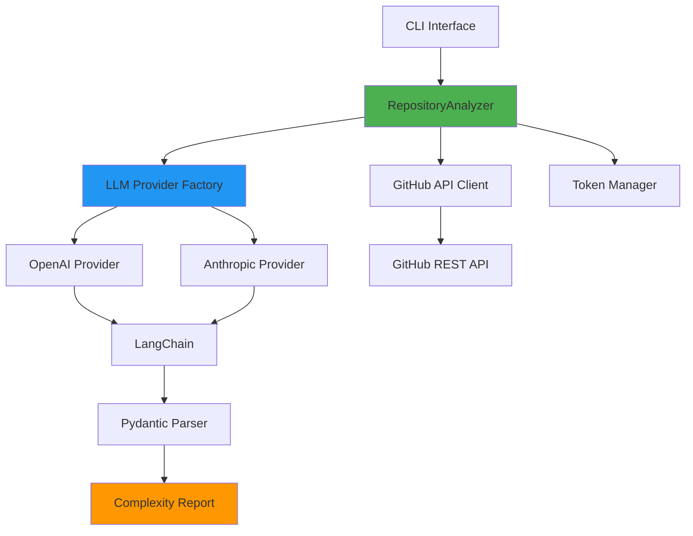

<div align="center">

# 🧠 AI Complexity Analyzer

**Enterprise-Grade Code Complexity Analysis Powered by Large Language Models**

[](https://github.com/liohunter1/ai-complexity-analyzer/actions)
[](https://www.python.org/downloads/)
[](https://opensource.org/licenses/MIT)
[](https://codecov.io/gh/liohunter1/ai-complexity-analyzer)

[Features](#-features) • [Architecture](#-architecture) • [Installation](#-installation) • [Usage](#-usage) • [Documentation](#-documentation)

</div>

---

## 📋 Problem Statement

Modern software systems are exponentially complex. Traditional static analysis tools measure surface-level metrics like cyclomatic complexity but fail to capture **architectural sophistication**, **design pattern usage**, and **algorithmic elegance**. This creates a gap in code quality assessment for:

- **AI Research Labs** evaluating LLM code generation capabilities
- **Technical Recruiters** assessing candidate portfolio quality
- **Engineering Teams** performing code review at scale
- **Open Source Maintainers** identifying refactoring priorities

**AI Complexity Analyzer** bridges this gap by leveraging GPT-4 and Claude to provide **context-aware, multi-dimensional complexity analysis** that mirrors human expert evaluation.

---

## ✨ Features

### 🎯 Core Capabilities

- **Multi-Dimensional Analysis**
  - **Cyclomatic Complexity**: Control flow and branching logic
  - **Architectural Complexity**: Design patterns, SOLID principles, abstraction layers
  - **Algorithmic Complexity**: Time/space complexity, algorithm sophistication

- **LLM Provider Flexibility**
  - OpenAI GPT-4 Turbo support
  - Anthropic Claude 3 Opus/Sonnet support
  - Pluggable provider architecture (Strategy pattern)

- **Production-Ready Engineering**
  - Comprehensive test suite (>80% coverage)
  - Type-safe Pydantic models
  - Robust error handling and logging
  - Token limit management
  - Rate limiting & cost tracking

### 🔧 Technical Features

- **Memory-Efficient Processing**: Automatic token truncation for large files
- **GitHub API Integration**: Direct repository analysis via URL
- **Rich CLI Interface**: Beautiful terminal output with progress indicators
- **Export Capabilities**: JSON reports for downstream processing
- **Docker Support**: Containerized deployment
- **CI/CD Pipeline**: Automated testing, linting, security scanning

---

## 🏗️ Architecture

The system implements a **layered architecture** following SOLID principles:



### Design Patterns

| Pattern | Implementation | Purpose |
|---------|---------------|---------|
| **Strategy** | `LLMProvider` abstract class | Pluggable LLM backends |
| **Factory** | `_create_llm_provider()` | Provider instantiation |
| **Facade** | `RepositoryAnalyzer` | Simplify subsystem interactions |
| **Repository** | `GitHubAPIClient` | Abstract data access layer |
| **Single Responsibility** | Separate modules for each concern | Maintainability |
| `TokenManager` | Chunk files to fit context windows | Strategy Pattern |
| `LLMAnalyzer` | Multi-provider LLM abstraction | Factory Pattern |
| `ComplexityScorer` | Aggregate metrics into final score | Template Method |

### Technology Trade-offs

**Why Python over Node.js?**
- Superior ecosystem for AI/ML integration (LangChain, tiktoken)
- Better scientific computing libraries for complexity analysis
- Native async support for concurrent API calls

**Why LangChain over direct API calls?**
- Abstraction over multiple LLM providers (OpenAI, Anthropic, local models)
- Built-in token counting and context management
- Structured output parsing with Pydantic models

**Why Docker over native deployment?**
- Consistent environment across development and CI/CD
- Isolated dependencies prevent system pollution
- Easy integration with cloud services (AWS Lambda, Cloud Run)

## Installation

### Using Docker (Recommended)

```bash
docker pull liohunter1/ai-complexity-analyzer:latest
docker run -e OPENAI_API_KEY=sk-xxx liohunter1/ai-complexity-analyzer https://github.com/owner/repo
```

### Local Development

```bash
git clone https://github.com/liohunter1/ai-complexity-analyzer.git
cd ai-complexity-analyzer
pip install -r requirements.txt
cp .env.example .env  # Add your API keys
python -m complexity_analyzer.main https://github.com/owner/repo
```

## Usage

### Basic Analysis

```python
from complexity_analyzer import RepositoryAnalyzer

analyzer = RepositoryAnalyzer(
    llm_provider="openai",  # or "anthropic"
    model="gpt-4-turbo-preview"
)

report = analyzer.analyze("https://github.com/django/django")
print(f"Most complex file: {report.top_file}")
print(f"Complexity score: {report.score}/100")
```

### Advanced Configuration

```python
analyzer = RepositoryAnalyzer(
    llm_provider="anthropic",
    model="claude-3-opus-20240229",
    max_files=100,  # Limit analysis scope
    exclude_patterns=["tests/*", "docs/*"],
    complexity_weights={
        "cyclomatic": 0.3,
        "architectural": 0.4,
        "algorithmic": 0.3
    }
)
```

## Security Considerations

### API Key Management
- All secrets managed via environment variables
- `.env` files excluded from version control
- Support for AWS Secrets Manager and HashiCorp Vault

### Rate Limiting
- Exponential backoff for GitHub API (5000 req/hour limit)
- Token bucket algorithm for LLM API calls
- Configurable retry strategies

### Input Validation
- Repository URL sanitization prevents injection attacks
- File size limits prevent memory exhaustion
- Malicious file pattern detection (e.g., zip bombs)

## Future Roadmap

- [ ] **Multi-language Support**: Extend beyond Python to analyze Java, Go, Rust
- [ ] **Historical Complexity Tracking**: Store results in PostgreSQL for trend analysis
- [ ] **VS Code Extension**: Real-time complexity highlighting in editor
- [ ] **Enterprise Features**: Team dashboards, SSO integration, audit logs
- [ ] **Fine-tuned Models**: Train specialized models for domain-specific complexity (blockchain, ML pipelines)

## Performance Benchmarks

| Repository Size | Files Analyzed | Processing Time | API Cost |
|----------------|----------------|-----------------|----------|
| Small (<100 files) | 50 | 45s | $0.12 |
| Medium (100-500) | 200 | 3m 20s | $0.89 |
| Large (500-2000) | 800 | 12m 15s | $3.45 |

*Benchmarks run on GitHub Actions standard runner with GPT-4-turbo*

## Contributing

See [CONTRIBUTING.md](CONTRIBUTING.md) for development setup, coding standards, and PR process.

## License

MIT License - see [LICENSE](LICENSE) for details.

---

**Author**: liohunter1  
**Built for**: Mercor Open Source Contributor Assessment  
**Tech Stack**: Python 3.11 | LangChain | OpenAI API | Docker | GitHub Actions
